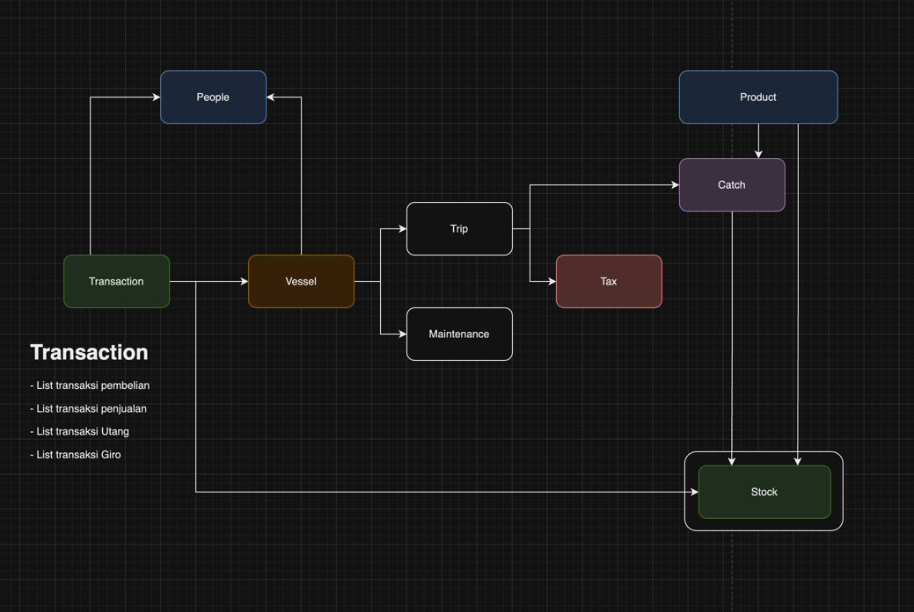

# VESSEL DATABASE

This repository contains the schema and documentation for the database tables used in a fisheries management system. Its provides a comprehensive overview of the database tables used in the fisheries management system, helping developers and users understand their structures, purposes, and relationships.
Below are brief descriptions of each table:

1. Products Table
Stores information about various products used in fisheries operations.
Includes fields such as product name, category, price, quantity in stock, supplier details, and more.
Usage: Useful for managing inventory, pricing, and supplier relationships.
2. Vessels Table
Manages data related to fishing vessels including their specifications, ownership, and operational details.
Contains fields like vessel name, type, registration details, dimensions, crew size, and safety equipment.
Usage: Essential for tracking vessel operations, compliance, and maintenance schedules.
3. Stocks Table
Tracks the inventory of products within the system, including their quantities, costs, and transaction details.
Includes fields for stock ID, product ID, quantity, location, pricing, supplier information, and transaction types.
Usage: Facilitates inventory management, stock replenishment, and transaction recording.
4. Peoples Table
Manages information about individuals associated with fisheries operations, such as suppliers, customers, and crew members.
Contains fields for personal details, contact information, and associations with vessels.
Usage: Helps in managing relationships with stakeholders and tracking personnel involved in operations.
5. Trips Table
Records details about fishing trips including departure and return dates, ports, vessels, and responsible captains.
Fields include trip name, dates, ports, vessel ID, captain ID, and additional notes.
Usage: Facilitates trip planning, scheduling, and tracking for operational and logistical purposes.
6. Transactions Table
Tracks various transactions within the fisheries management system, including purchases, sales, returns, and debt settlements.
Includes fields such as transaction type, item ID, quantity, prices, involved parties, and payment details.
Usage: Enables financial tracking, auditing, and analysis of transactions within the system.
7. Maintenances Table
Manages records of maintenance tasks performed on fishing vessels, including dates, descriptions, parts used, and costs.
Contains fields for maintenance ID, date, description, parts used, cost, and vessel ID.
Usage: Supports maintenance scheduling, cost tracking, and compliance with maintenance regulations.
8. Catches Table
Records information about fish catches made during fishing trips, including dates, locations, quantities, vessels, and trips.
Fields include catch ID, product ID, catch date, location, quantity, vessel ID, trip ID, and additional notes.
Usage: Tracks catch data for analysis, reporting, and regulatory compliance purposes.

# Product Endpoints
## Create Product

#### Method: POST
URL: /products/\
Handler Function: CreateProduct\
Description: Creates a new product entry in the database.
Update Product

#### Method: PUT
URL: /products/\
Handler Function: UpdateProduct\
Description: Updates an existing product entry in the database.
List Products

#### Method: GET
URL: /products/\
Handler Function: ProductList\
Description: Retrieves a list of all products available in the database.
Get Product

#### Method: GET
URL: /products/:pid/\
Handler Function: GetProduct\
Description: Retrieves details of a specific product identified by :pid.
Delete Product

#### Method: DELETE
URL: /products/:pid/\
Handler Function: DeleteProduct\
Description: Deletes a specific product entry from the database identified by :pid.

# Vessel Endpoints
## Create Vessel

#### Method: POST
URL: /vessels/\
Handler Function: CreateVessel\
Description: Creates a new vessel entry in the database.
Update Vessel

#### Method: PUT
URL: /vessels/\
Handler Function: UpdateVessel\
Description: Updates an existing vessel entry in the database.
List Vessels

#### Method: GET
URL: /vessels/\
Handler Function: VesselList\
Description: Retrieves a list of all vessels available in the database.
Get Vessel

#### Method: GET
URL: /vessels/:vid/\
Handler Function: GetVessel\
Description: Retrieves details of a specific vessel identified by :vid.
Delete Vessel

#### Method: DELETE
URL: /vessels/:vid/\
Handler Function: DeleteVessel\
Description: Deletes a specific vessel entry from the database identified by :vid.

# Trip Endpoints
## Create Trip

#### Method: POST
URL: /trips/\
Handler Function: CreateTrip\
Description: Creates a new trip entry in the database.
Update Trip

#### Method: PUT
URL: /trips/\
Handler Function: UpdateTrip\
Description: Updates an existing trip entry in the database.
List Trips

#### Method: GET
URL: /trips/\
Handler Function: TripList\
Description: Retrieves a list of all trips available in the database.
Get Trip

#### Method: GET
URL: /trips/:tid/\
Handler Function: GetTrip\
Description: Retrieves details of a specific trip identified by :tid.
Delete Trip

#### Method: DELETE
URL: /trips/:tid/\
Handler Function: DeleteTrip\
Description: Deletes a specific trip entry from the database identified by :tid.

# Stock Endpoints
## Create Stock

#### Method: POST
URL: /stocks/\
Handler Function: CreateStock\
Description: Creates a new stock entry in the database.
Update Stock

#### Method: PUT
URL: /stocks/\
Handler Function: UpdateStock\
Description: Updates an existing stock entry in the database.
List Stocks

#### Method: GET
URL: /stocks/\
Handler Function: StockList\
Description: Retrieves a list of all stock entries available in the database.
Get Stock

#### Method: GET
URL: /stocks/:sid/\
Handler Function: GetStock\
Description: Retrieves details of a specific stock identified by :sid.
Delete Stock

#### Method: DELETE
URL: /stocks/:sid/\
Handler Function: DeleteStock\
Description: Deletes a specific stock entry from the database identified by :sid.

# Transaction Endpoints
## Create Transaction

#### Method: POST
URL: /transaction/\
Handler Function: CreateTransaction\
Description: Creates a new transaction entry in the database.
Update Transaction

#### Method: PUT
URL: /transaction/\
Handler Function: UpdateTransaction\
Description: Updates an existing transaction entry in the database.
List Transactions

#### Method: GET
URL: /transaction/\
Handler Function: TransactionList\
Description: Retrieves a list of all transactions available in the database.
Get Transaction

#### Method: GET
URL: /transaction/:tid/\
Handler Function: GetTransaction\
Description: Retrieves details of a specific transaction identified by :tid.
Delete Transaction

#### Method: DELETE
URL: /transaction/:tid/\
Handler Function: DeleteTransaction\
Description: Deletes a specific transaction entry from the database identified by :tid.

# Catch Endpoints
## Create Catch

#### Method: POST
URL: /catches/\
Handler Function: CreateCatch\
Description: Creates a new catch entry in the database.
Update Catch

#### Method: PUT
URL: /catches/\
Handler Function: UpdateCatch\
Description: Updates an existing catch entry in the database.
List Catches

#### Method: GET
URL: /catches/\
Handler Function: CatchList\
Description: Retrieves a list of all catches available in the database.
Get Catch

#### Method: GET
URL: /catches/:cid/\
Handler Function: GetCatch\
Description: Retrieves details of a specific catch identified by :cid.
Delete Catch

#### Method: DELETE
URL: /catches/:cid/\
Handler Function: DeleteCatch\
Description: Deletes a specific catch entry from the database identified by :cid.

# People Endpoints
# Create Person

#### Method: POST
URL: /peoples/\
Handler Function: CreatePerson\
Description: Creates a new person entry in the database.
Update Person

#### Method: PUT
URL: /peoples/\
Handler Function: UpdatePerson\
Description: Updates an existing person entry in the database.
List People

#### Method: GET
URL: /peoples/\
Handler Function: PeopleList\
Description: Retrieves a list of all people entries available in the database.
Get Person

#### Method: GET
URL: /peoples/:pid/\
Handler Function: GetPerson\
Description: Retrieves details of a specific person identified by :pid.
Delete Person

#### Method: DELETE
URL: /peoples/:pid/\
Handler Function: DeletePerson\
Description: Deletes a specific person entry from the database identified by :pid.

# Maintenance Endpoints
## Create Maintenance

#### Method: POST
URL: /maintenances/\
Handler Function: CreateMaintenance\
Description: Creates a new maintenance task entry in the database.
Update Maintenance

#### Method: PUT
URL: /maintenances/\
Handler Function: UpdateMaintenance\
Description: Updates an existing maintenance task entry in the database.
List Maintenances

#### Method: GET
URL: /maintenances/\
Handler Function: MaintenanceList\
Description: Retrieves a list of all maintenance tasks available in the database.
Get Maintenance

#### Method: GET
URL: /maintenances/:mid/\
Handler Function: GetMaintenance\
Description: Retrieves details of a specific maintenance task identified by :mid.
Delete Maintenance

#### Method: DELETE
URL: /maintenances/:mid/\
Handler Function: DeleteMaintenance\
Description: Deletes a specific maintenance task entry from the database identified by :mid.
